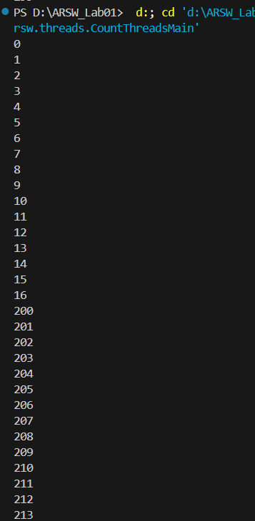
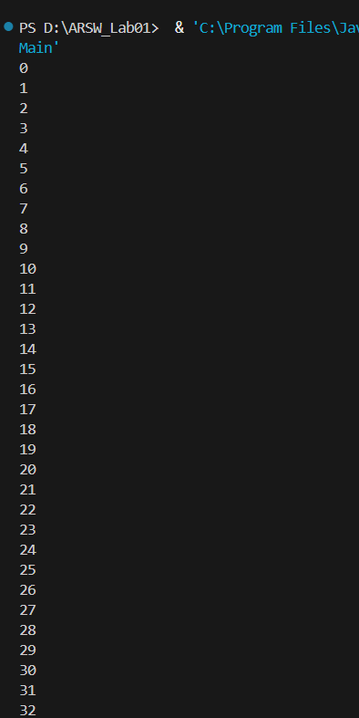
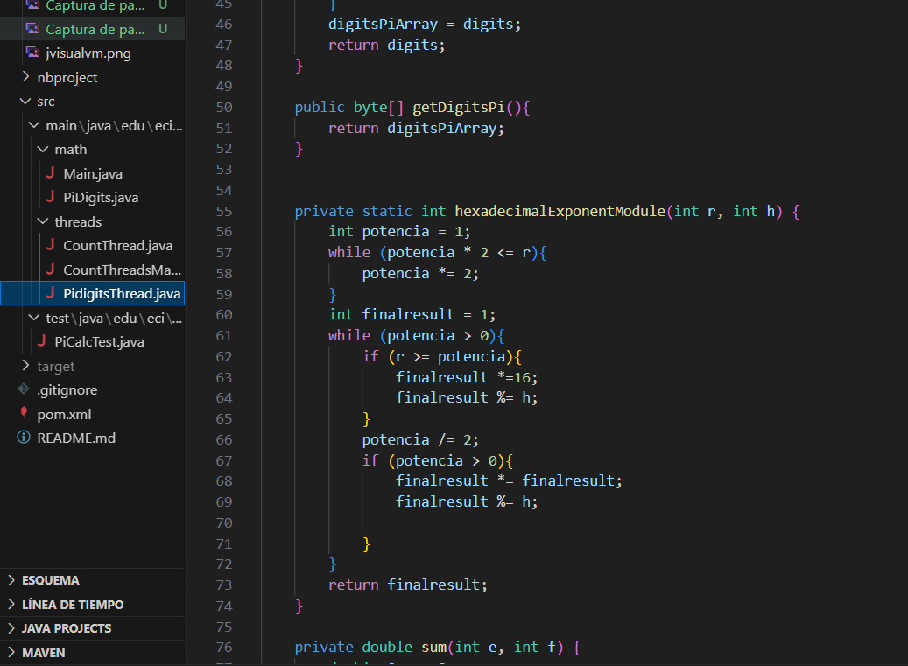

## Escuela Colombiana de Ingeniería
### Arquitecturas de Software

### Introducción al paralelismo - hilos
## INTEGRANTES:
### Santiago Guerra
### Andrés Rodríguez

Entrega: Martes en el transcurso del día.
Entregar: Fuentes y documento PDF con las respuestas.

## Introducción

En el ámbito de la arquitectura de software, uno de los desafíos clave es la optimización del rendimiento mediante el uso eficiente de los recursos de nuestro sistema(equipo). El paralelismo nos permite ejecutar múltiples tareas simultáneamente, es considerada una de las mejores estrategias por su efectividad a la hora de mejorar tanto la velocidad como la capacidad de procesamiento de un programa. En este laboratorio usaremos el uso de Hilos en JAVA para separar tareas complejas en múltiples subprocesos, aprovechando los núcleos de procesamiento de nuestro equipo.

**Parte I Hilos Java**

1. De acuerdo con lo revisado en las lecturas, complete las clases CountThread, para que las mismas definan el ciclo de vida de un hilo que imprima por pantalla los números entre A y B.
2. Complete el método __main__ de la clase CountMainThreads para que:
	1. Cree 3 hilos de tipo CountThread, asignándole al primero el intervalo [0…99], al segundo [99…199], y al tercero [200…299].
	2. Inicie los tres hilos con 'start()'.
	3. Ejecute y revise la salida por pantalla. 
	4. Cambie el inicio con 'start()' por 'run()'. Cómo cambia la salida?, ¿por qué?

 ## Desarrollo Parte I 

Para esta primera parte, inciso 1, se completa clase CountThread primero heredando de la clase Thread en java para trabajar con hilos.
Se definen dos variables que serán los límites del rango que solicita el ejercicio
Definimos un constructor
Finalmente, hacemos una sobrescritura del método run 

En el inciso 2, Se crean los 3 hilos, con los rangos correspondientes y su respectiva inicialización.

Veamos que sucede cuando los ejecutamos:

Esta respuesta es correcta debido a que los hilos se ejecutan en paralelo, y el sistema lo que hace es ir mostrando la salida de un hilo, luego del otro, y del otro, entrecruzadas.

Inciso 3, si cambiamos la inicialización por el método run, sucede lo siguiente:

Al hacerlo, obtenemos que las salidas se muestran en orden, esto sucede debido a que run() invoca un hilo y en ese hilo es donde se ejecuta el código, diferente a start(), que crea un nuevo hilo de ejecución y a su vez invoca a run() en ese nuevo hilo.

**Parte II Hilos Java**

La fórmula [BBP](https://en.wikipedia.org/wiki/Bailey%E2%80%93Borwein%E2%80%93Plouffe_formula) (Bailey–Borwein–Plouffe formula) es un algoritmo que permite calcular el enésimo dígito de PI en base 16, con la particularidad de no necesitar calcular nos n-1 dígitos anteriores. Esta característica permite convertir el problema de calcular un número masivo de dígitos de PI (en base 16) a uno [vergonzosamente paralelo](https://en.wikipedia.org/wiki/Embarrassingly_parallel). En este repositorio encontrará la implementación, junto con un conjunto de pruebas. 

Para este ejercicio se quiere calcular, en el menor tiempo posible, y en una sola máquina (aprovechando las características multi-core de la mismas) al menos el primer millón de dígitos de PI (en base 16). Para esto

1. Cree una clase de tipo Thread que represente el ciclo de vida de un hilo que calcule una parte de los dígitos requeridos.
2. Haga que la función PiDigits.getDigits() reciba como parámetro adicional un valor N, correspondiente al número de hilos entre los que se va a paralelizar la solución. Haga que dicha función espere hasta que los N hilos terminen de resolver el problema para combinar las respuestas y entonces retornar el resultado. Para esto, revise el método [join](https://docs.oracle.com/javase/tutorial/essential/concurrency/join.html) del API de concurrencia de Java.
3. Ajuste las pruebas de JUnit, considerando los casos de usar 1, 2 o 3 hilos (este último para considerar un número impar de hilos!)

## Desarrollo Parte II

Inciso 1, creamos una nueva clase de tipo thread, con nuevos constructores y  variables definidas, nos podemos apalancar de los métodos getDigits, HexadecimalExponent y sum, que se encuentran el repositorio de apoyo del laboratorio, estos métodos representan el ciclo de vida de un hilo 

Inciso 2, modificamos el método getDigits de la clase Pdigits, para recibir un parámetro adicional N, y utilizamos el método join para que el hilo principal, espere a que los hilos N, terminen, para al final combinar los resultados en la lista

Inciso 3 Pruebas

Para las pruebas unicamente, debemos agregar, un parametro adicional el metodo getdigits que sera los casos uso al usar 1 2 o 3 hilos

**Parte III Evaluación de Desempeño**

A partir de lo anterior, implemente la siguiente secuencia de experimentos para calcular el millon de dígitos (hex) de PI, tomando los tiempos de ejecución de los mismos (asegúrese de hacerlos en la misma máquina):

1. Un solo hilo.
2. Tantos hilos como núcleos de procesamiento (haga que el programa determine esto haciendo uso del [API Runtime](https://docs.oracle.com/javase/7/docs/api/java/lang/Runtime.html)).
3. Tantos hilos como el doble de núcleos de procesamiento.
4. 200 hilos.
5. 500 hilos.

Al iniciar el programa ejecute el monitor jVisualVM, y a medida que corran las pruebas, revise y anote el consumo de CPU y de memoria en cada caso. 

Con lo anterior, y con los tiempos de ejecución dados, haga una gráfica de tiempo de solución vs. número de hilos. Analice y plantee hipótesis con su compañero para las siguientes preguntas (puede tener en cuenta lo reportado por jVisualVM):

## Desarrollo Parte III

1) Con un solo hilo
   

2) Con tantos hilos como nucleo del procesador
   

3) Con tanto hilos como el doble de nucleos del procesador
   

4) Con 200 hilos

5) Con 500 hilos

1. Según la [ley de Amdahls](https://www.pugetsystems.com/labs/articles/Estimating-CPU-Performance-using-Amdahls-Law-619/#WhatisAmdahlsLaw?):

	, donde _S(n)_ es el mejoramiento teórico del desempeño, _P_ la fracción paralelizable del algoritmo, y _n_ el número de hilos, a mayor _n_, mayor debería ser dicha mejora. Por qué el mejor desempeño no se logra con los 500 hilos?, cómo se compara este desempeño cuando se usan 200?. 

	R: Si bien es cierto que en la teoría una mayor cantidad de hilos indicaría una mejora en el desempeño y rendimiento, en la práctica no siempre es el caso ya que hay varios factores que inflyen, por ejemplo, a medida que el número de hilos crece, el sistema operativo debe administrar más contextos de ejecución, lo que genera un overhead significativo. También, si los hilos están accediendo a memoria compartida o compitiendo por bloqueos, el aumento de hilos puede generar más latencias (algo que se ve claramente en el consumo de CPU con las fluctuaciones en la gráfica de uso) en lugar de mejorar el desempeño.

2. Cómo se comporta la solución usando tantos hilos de procesamiento como núcleos comparado con el resultado de usar el doble de éste?.
	R:Cuando el número de hilos es igual al número de núcleos del procesador: se logra un balance adecuado entre cómputo paralelo y administración de recursos, además cada núcleo puede ejecutar un hilo sin necesidad de cambiar de contexto constantemente.
	
	Cuando se usa el doble de hilos que núcleos: aumenta el overhead de cambio de contexto, ya que un núcleo debe alternar entre múltiples hilos. Si el problema es altamente computacional y no depende de I/O, el beneficio es mínimo. Si la carga de trabajo implica esperas por I/O (como acceso a bases de datos o red), el uso de más hilos podría ser beneficioso.

3. De acuerdo con lo anterior, si para este problema en lugar de 500 hilos en una sola CPU se pudiera usar 1 hilo en cada una de 500 máquinas hipotéticas, la ley de Amdahls se aplicaría mejor?. Si en lugar de esto se usaran c hilos en 500/c máquinas distribuidas (siendo c es el número de núcleos de dichas máquinas), se mejoraría?. Explique su respuesta.

	R: Si en vez de ejecutar 500 hilos en una única CPU, se repartieran 1 hilo por cada máquina en 500 máquinas hipotéticas, la Ley de Amdahl tendría mayor aplicación porque: cada dispositivo contaría con su propio procesador, previniendo la rivalidad por los núcleos. Se disminuye el volumen de gestión de hilos en una única CPU y el paralelismo sería más efectivo, puesto que cada dispositivo podría llevar a cabo su labor sin interferencias.
	Ahora bien, si en vez de emplear 1 hilo por máquina, se emplearan c hilos en 500/c máquinas, el rendimiento podría incrementarse aún más. Motivos: cada dispositivo emplearía sus núcleos de forma eficiente, incrementando el paralelismo sin saturación, disminuiría la latencia en la comunicación frente a 500 máquinas que solo poseen 1 hilo cada una. Finalmente se equilibraría de manera más efectiva la carga.

	Concluyendo, ambas alternativas mejoran el rendimiento en la aplicación, sin embargo, por lo mencionado anteriormente se recomienda la opción de usar c hilos en 500/c máquinas.

#### Criterios de evaluación.

1. Funcionalidad:
	- El problema fue paralelizado (el tiempo de ejecución se reduce y el uso de los núcleos aumenta), y permite parametrizar el número de hilos usados simultáneamente.

2. Diseño:
	- La signatura del método original sólo fue modificada con el parámetro original, y en el mismo debe quedar encapsulado la paralelización e inicio de la solución, y la sincronización de la finalización de la misma.
	- Las nuevas pruebas con sólo UN hilo deben ser exactamente iguales a las originales, variando sólo el parámetro adicional. Se incluyeron pruebas con hilos adicionales, y las mismas pasan.
	- Se plantea un método eficiente para combinar los resultados en el orden correcto (iterar sobre cada resultado NO sera eficiente).

3. Análisis.
	- Se deja evidencia de la realización de los experimentos.
	- Los análisis realizados son consistentes.
